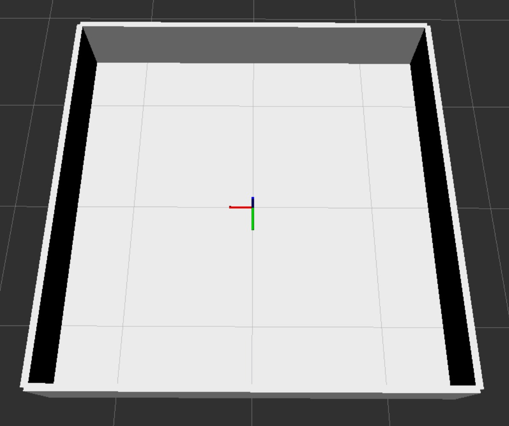
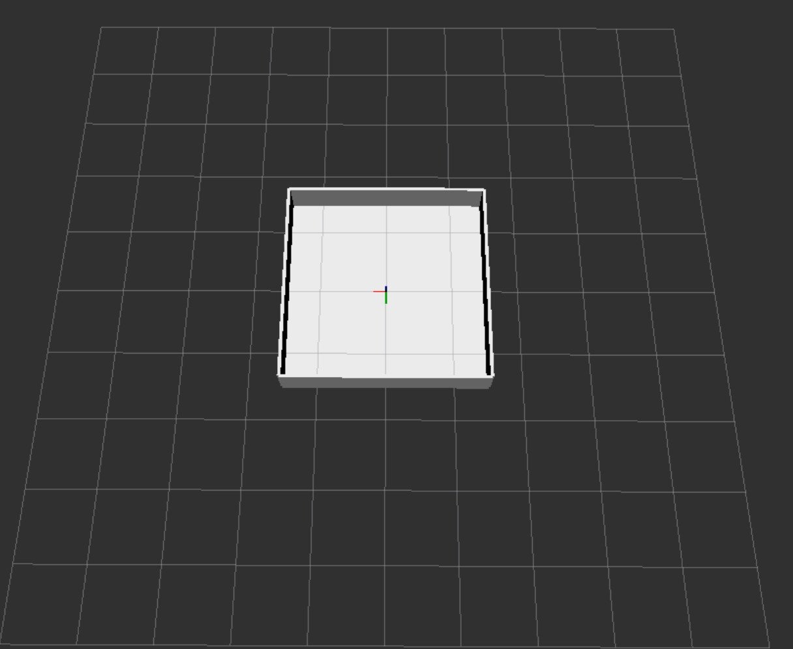

# Gráficos:
Para iniciar a interface gráfica do container, execute o script `start_vnc.sh` e depois rode o comando `vncviewer localhost:5901` para acessar a interface gráfica do container, conectando através do Finder do MacOS ou usando um cliente VNC. A senha para acessar a interface gráfica é definida pelo comando.

# Criar ROS2 package:
```bash
cd ~/<nome_do_workspace/atividade>/src
ros2 pkg create --build-type ament_cmake <nome_do_pacote> ou
ros2 pkg create --build-type ament_python <nome_do_pacote>
```
# Ros_control:
```bash
vcs import src < src/ros2.repos
rosdep install --from-paths src --ignore-src -y
colcon build --symlink-install
source install/setup.bash
``` 
Importante para baixar os repos necessários para o ros_control, como o `ros2_control` e o `ros2_controllers`, que são essenciais para a implementação do módulo de controle do robô na simulação. Não funciona em macos.

# Compilar o workspace:
```bash
cd ~/<nome_do_workspace/atividade>
colcon build --symlink-install
source install/setup.bash
```

# Visualização no RViz:
```bash
# Terminal 1 — publish robot description
DISPLAY=:1 LIBGL_ALWAYS_SOFTWARE=1 ros2 run robot_state_publisher robot_state_publisher \
  --ros-args -p robot_description:="$(xacro /workspaces/build-your-own-simulated-race-track-cobras-da-robotica/install/real_test_robot/share/real_test_robot/urdf/real_test_robot.urdf.xacro)"

# Terminal 2 — open RViz
DISPLAY=:1 LIBGL_ALWAYS_SOFTWARE=1 ros2 run rviz2 rviz2
```


# Simulação no Gazebo com o mundo personalizado:
```bash
colcon build --packages-select real_test_robot
source install/setup.bash
DISPLAY=:1 LIBGL_ALWAYS_SOFTWARE=1 ros2 launch real_test_robot launch_sim.launch.py
```
O modelo de mundo criado para a atividade segue a estrutura de um arquivo SDF, onde são definidos os elementos do ambiente, como luz, chão e paredes. Cada elemento é representado por um modelo com suas propriedades específicas, como posição, tamanho e material. O arquivo SDF é utilizado para configurar o ambiente de simulação no Gazebo, permitindo a criação de cenários personalizados para testes e desenvolvimento de robôs.

A pista ficou desenvolvida como visto nas imagens em arena1.jpeg e arena2.jpeg (código arena.sdf), em que o layout é simples, representando um quadrado com 4 paredes, que o robô deve evitar a colisão.

A mudança do outro código é a implementação do módulo de controle do ROS2, permitindo que conectamos sensores como o lidar para realizar a navegação autônoma do robô, utilizando o pacote `ros_gz_bridge` para integrar o Gazebo com o ROS2. O módulo de controle é implementado utilizando o `ros2_control`, que é uma estrutura de controle em tempo real para robôs, permitindo a criação de controladores personalizados para diferentes tipos de robôs e atuadores. Com essa implementação, é possível controlar o movimento do robô e realizar tarefas de navegação autônoma no ambiente simulado, como a task de SLAM (Simultaneous Localization and Mapping), onde o robô pode mapear o ambiente enquanto se localiza dentro dele, utilizando os dados do lidar para criar um mapa do ambiente e navegar de forma autônoma.




# Rodando SLAM + NAV2:
## SLAM
```bash
sudo apt install ros-jazzy-slam-toolbox
cp /opt/ros/jazzy/share/slam_toolbox/config/mapper_params_online_async.yaml src/real_test_robot/config/
colcon build --packages-select real_test_robot
source install/setup.bash
ros2 launch slam_toolbox online_async_launch.py use_sim_time:=true params_file:=./src/articubot_one/config/mapper_params_online_async.yaml
```

## NAV2
```bash
sudo apt install ros-jazzy-navigation2 ros-jazzy-nav2-bringup ros-jazzy-turtlebot3*
cp /opt/ros/jazzy/share/nav2_bringup/params/nav2_params.yaml  src/real_test_robot/config/
colcon build --packages-select real_test_robot
source install/setup.bash
ros2 launch slam_toolbox online_async_launch.py params_file:=src/articubot_one/config/mapper_params_online_async.yaml use_sim_time:=true
# Em outro terminal
ros2 launch nav2_bringup navigation_launch.py params_file:=src/my_bot/config/nav2_params.yaml use_sim_time:=true
```

Para visualizar no RVIZ, basta abrir um novo terminal e rodar o comando:
```bash
rviz2 --ros-args -p use_sim_time:=true
```
